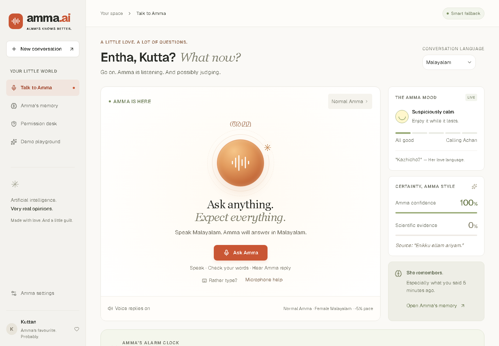
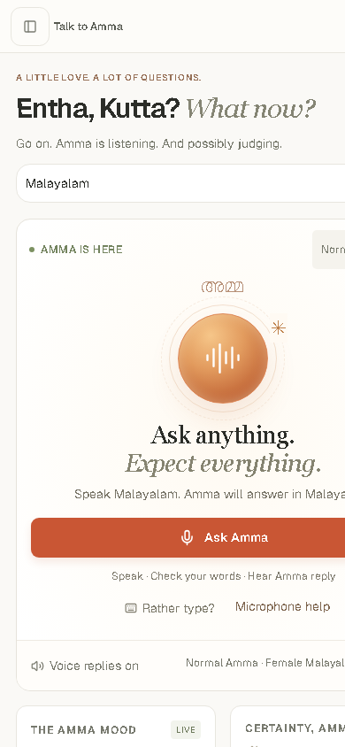
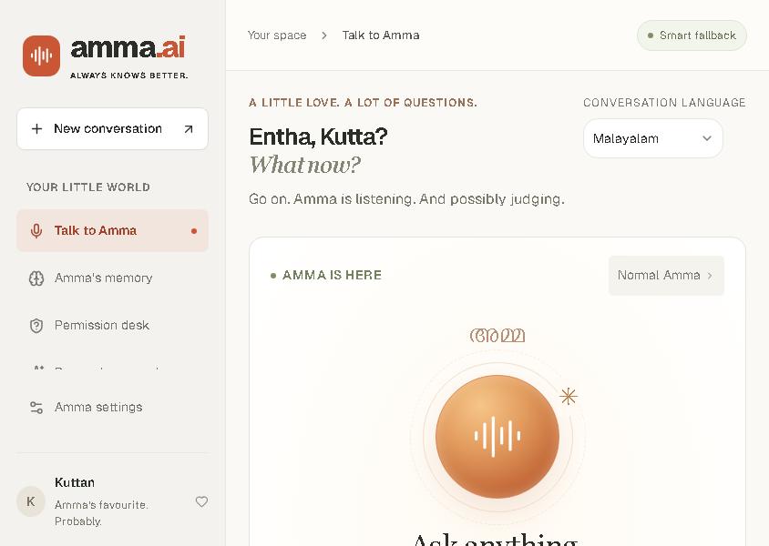
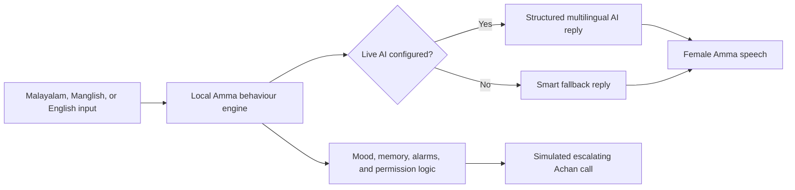

<p align="center">
  
</p>

# Amma AI 🎯

## Basic Details

### Team Name: Amma AI

### Team Members

- Team Lead: [Abel Leslie E](https://github.com/AbelLeslieE) - College details to be added
- Member 2: [Albert Sibichan Jacob](https://github.com/albert-sibichan-jacob) - College details to be added

### Project Description

Amma AI is a voice-first Malayalam comedy app that behaves like an extremely opinionated virtual Amma. It understands Malayalam, Manglish, English, and mixed speech; changes personality by region; remembers suspicious statements; sets alarms one hour earlier than requested; and calls in an increasingly angry Achan when the permission interview goes badly.

### The Problem (that doesn't exist)

People are dangerously close to making their own decisions, setting alarms for the time they actually requested, and ending conversations without being asked whether they ate.

### The Solution (that nobody asked for)

We made an AI Amma who supplies unsolicited advice, affectionate interrogation, Malayalam comedy, regional personalities, early alarms, and a simulated Achan escalation system. It is wonderfully unnecessary and fully usable on phones.

## Technical Details

### Technologies/Components Used

For Software:

- Languages: TypeScript, JavaScript, HTML, CSS, Malayalam, and Manglish
- Frameworks: React 19 and Vinext
- Libraries: Base UI, Shadcn components, Lucide React, and date-fns
- AI: OpenAI Responses, speech-to-text, and text-to-speech APIs with an offline scripted fallback
- Tools: Node.js 24, GitHub, Render, edge-tts, TypeScript, Oxlint, and Oxfmt

For Hardware:

- A phone, tablet, or computer with a modern browser
- A microphone for voice input
- No custom hardware required

### Implementation

For Software:

# Installation

```bash
git clone https://github.com/AbelLeslieE/Amma-AI-Web_temp.git
cd Amma-AI-Web_temp
npm ci
```

# Run

```bash
npm run dev
```

Open the local address printed by the development server. Copy `.env.example` to `.env.local` and add a private `OPENAI_API_KEY` to enable live AI; the app remains usable in Smart fallback mode without a key.

### Project Documentation

For Software:

# Screenshots


_The desktop conversation screen with voice input, language selection, Amma mood, memory, and alarm controls._


_The phone layout keeps the Malayalam voice interaction and touch controls available on a narrow screen._


_The responsive landscape layout preserves navigation, personality selection, and the main voice interaction._

# Diagrams



_The local engine protects the comedy rules while optional AI improves free-form multilingual understanding and speech._

For Hardware:

# Schematic & Circuit

Not applicable. Amma only needs a browser and, optionally, a microphone.

# Build Photos

Not applicable for this software project. The three interface captures above document the working build.

### Project Demo

# Video

Demo video to be added before the final hackathon submission.

# Additional Demos

- [Live Amma AI prototype](https://amma-ai-g4di.onrender.com/)
- [Collaboration guide](CONTRIBUTING.md)
- [Hackathon readiness checklist](docs/HACKATHON_CHECKLIST.md)

## Team Contributions

- Abel Leslie E: concept, product direction, frontend integration, Malayalam behavior, and deployment
- Albert Sibichan Jacob: collaborator for testing, refinements, documentation, and pull-request contributions

---

Made with ❤️ at TinkerHub Useless Projects


The untouched event README is retained in [`README_TEMPLATE.md`](README_TEMPLATE.md).
